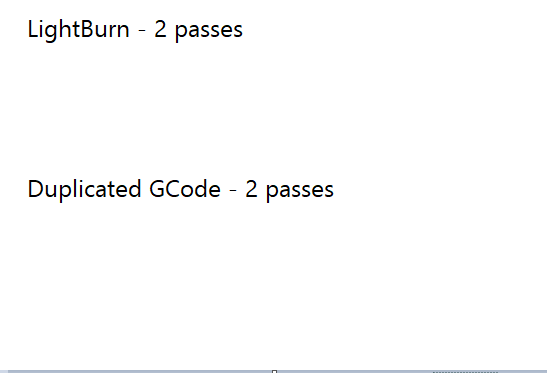
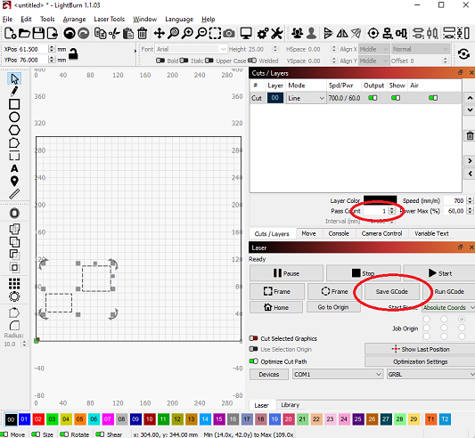
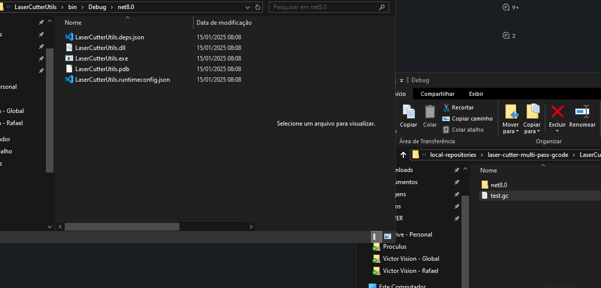

# The problem
When cutting shapes on a laser cutter using LightBurn, if you select "n" passes for a layer, each SHAPE on the layer will be cut "n" times, one shape after the other.

What is usually desired is that ALL SHAPES are cut at once, then all shapes are cut again, until you have "n" passes of the full cut.

This is a problem if the cut has small shapes or short lines, since the laser will pass on the same region multiple times in quick succession, burning or charring it too much.

# The workaround
This C# project creates a simples CLI executable that duplicates the cut portion of exported GCode from LightBurn.

Whe your cut setup is ready, just set the layer "passes = 1", export the GCode, drag and drop the .gc file on top of the .exe file. It will generate a new .gc file with as many passes as you choose.

2 passes from LightBurn:
https://www.youtube.com/shorts/Pf8ZAnT1s_Y

2 passes from duplicated GCode:
https://www.youtube.com/shorts/tTe7OaPypWk

# Usage
1. Setup your cut properly.
1. Set the number of passes for your layer to 1.
1. Click on "Save GCode" and save it with ".gc" extension.
1. Drag the exported .gc file and drop it on the executable file.
1. Click on "Run GCode" and select the exported file to load the new GCode and start the cut job.

